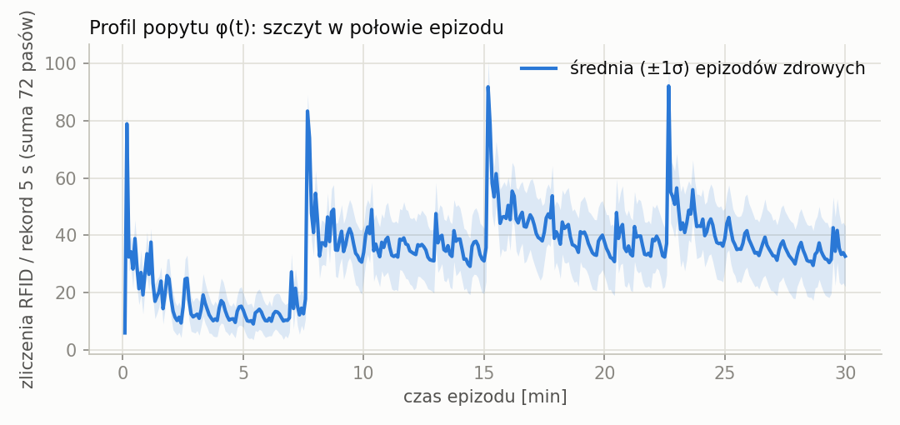
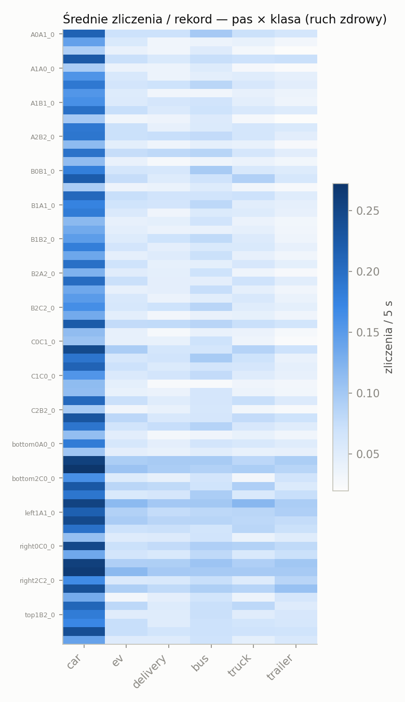
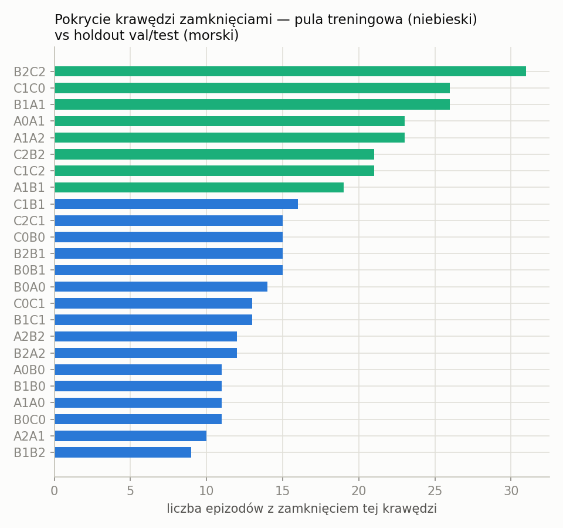
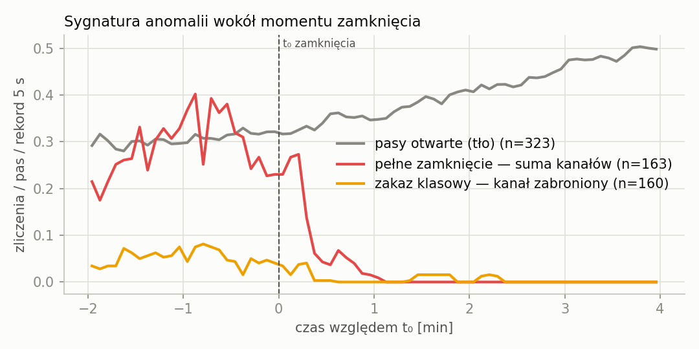
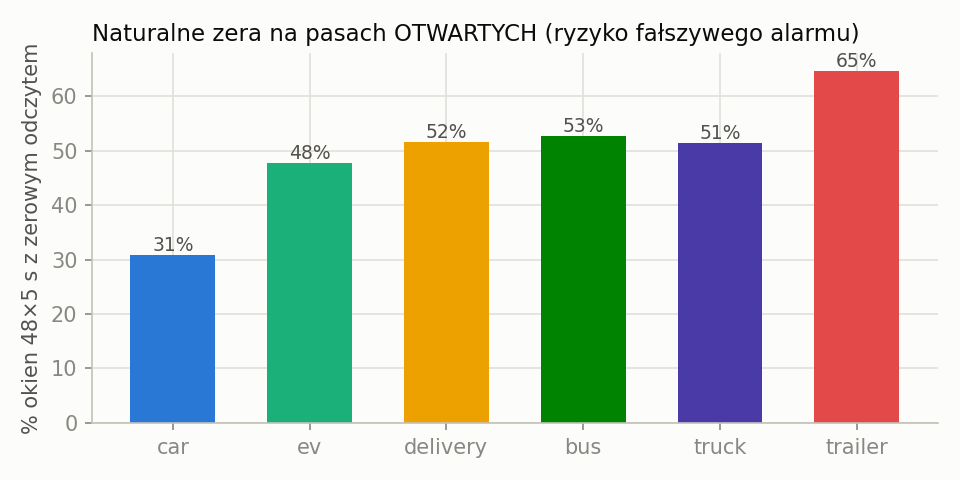

# Raport: dataset `grid_rfid_v2` — ruch, anomalie i tło losowe

**Dataset:** `datasets/grid_rfid_v2` (300 epizodów × 1800 s, seed 2025, class set v2,
`--class-ban-frac 0.5`). **Paczka CSV dla zewnętrznej placówki:** `export/grid_rfid_v2_csv/`
(z angielskim data-dictionary; round-trip do `.npz` zweryfikowany 1:1).
**Figury i liczby:** `docs/figures/grid_rfid_v2/` (`stats.json`), generowane skryptem
`scripts/analyze_grid_rfid_dataset.py` — wszystkie wartości w tym raporcie są reprodukowalne.

---

## 1. Scena: siatka 3×3 i detekcja

Sygnalizowana krata 3×3 (9 skrzyżowań A0…C2, po 2 pasy na wlot), światła sterowane
statycznym programem SUMO. **72 monitorowane pasy wjazdowe** = 72 detektory pętli E1
w połowie długości pasa; indeks pasa (0–71, `lanes.csv`) definiuje kolumny etykiet.
Zliczenia rozbite na **6 klas pojazdów** (v2):

| klasa | vClass | udział popytu | charakter kinematyczny |
|---|---|---|---|
| car | passenger | 52 % | referencyjny |
| ev | evehicle | 18 % | najostrzejsze przyspieszenie (3,4 m/s²) |
| delivery | delivery | 10 % | wolniejszy, dłuższy |
| bus | bus | 8 % | wolny start, 12 m |
| truck | truck | 8 % | ciężki (1,0 m/s², 10 m) |
| trailer | trailer | 4 % | najwolniejszy i najdłuższy (0,7 m/s², 16,5 m) |

**Semantyka zliczeń (ważne przy interpretacji):** detektor liczy *obecność-sekundy*
(pojazd stojący na pętli 3 s = 3 zliczenia), nie unikalne przejazdy. Klasy wolne
i długie (bus, trailer) są przez to systematycznie „głośniejsze" niż ich udział
w popycie — patrz §3. Semantyka jest stała w czasie, więc względne zmiany (a to one
niosą sygnał anomalii) pozostają miarodajne.

## 2. Tło losowe: model popytu (reżim zdrowy)

Każdy epizod losuje własny wzorzec obciążenia — model uczony na train widzi
**rozkład** ruchu, nie jeden scenariusz:

- **Korytarze:** 2–3 losowo wybrane wloty brzegowe (z 12) stają się „ciężkie";
  szczytowa intensywność każdego losowana z **U(900, 1800) veh/h**, rozbita na
  6 klas wg udziałów popytu. Cel korytarza: losowy wylot po przeciwnej stronie siatki.
- **Tło:** 600 veh/h rozłożone równo na wszystkie 12 wlotów (50 veh/h każdy),
  w v2 również z pełnym mixem klas — dzięki temu każda krawędź wewnętrzna niesie
  ruch klas „bannable" i zakaz klasowy jest wszędzie wykrywalny.
- **Profil czasowy φ(t):** gaussowski szczyt w połowie epizodu
  (t_peak = 900 s, σ = 360 s, poziom minimalny 20 % szczytu), realizowany
  w **4 interwałach** stałych przepływów. To „doba w pigułce": rozjazd → szczyt →
  wyciszenie.
- **Test:** popyt ustalony (stałe korytarze W/E/N o szczytach 1800/900/1200 veh/h) —
  reprodukowalny, niewidziany w treningu wzorzec.

Artefakt do świadomego zapamiętania: na granicach interwałów SUMO restartuje
definicje przepływów, co daje krótkie piki wstawień pojazdów widoczne w profilu
(figura f1). To cecha generatora, nie anomalia.

## 3. Jak losowane są anomalie

Dwa typy anomalii **strukturalnych** (żadna nie jest szumem sensora):

1. **Pełne zamknięcie** — losowa krawędź wewnętrzna (między dwoma skrzyżowaniami)
   dostaje `disallow` dla wszystkich klas na obu pasach + kara czasu przejazdu.
   Wszystkie 6 kanałów RFID pasa gaśnie; ruch reroutuje się (urządzenie rerouting,
   okres 20 s). Etykieta pasa `y = 1.0`.
2. **Zakaz klasowy** — ta sama krawędź, ale `disallow` tylko dla 1–2 klas
   wylosowanych z puli **{truck, trailer, delivery, bus}**. Gaśnie wyłącznie kanał
   zabronionej klasy; pozostały ruch jedzie normalnie. Etykieta ciągła
   `y = suma udziałów popytu zabronionych klas` (np. delivery+bus → 0,18);
   pełna prawda per klasa w `Y_class`/`labels_records_*`.

Parametry losowania (per epizod anomalny):

- liczba zamkniętych krawędzi: **1–3** (jednostajnie),
- moment startu `t0 ~ U(0, 600 s)` (pierwsza tercja epizodu), zamknięcie trwa do końca,
- tryb klasowy z prawdopodobieństwem **0,5**; w nim każda zamknięta krawędź losuje
  własny podzbiór 1–2 klas,
- **pule lokalizacji rozłączne:** train losuje z 16 krawędzi, val/test wyłącznie
  z 8 krawędzi holdout — ewaluacja odbywa się na **nieoglądanych miejscach** sieci
  (pełna lista w `manifest.json`).

Struktura zbiorów: train = 100 epizodów zdrowych + 100 anomalnych; val = 50 anomalnych
(holdout, popyt losowy); test = 50 anomalnych (holdout + ustalony popyt testowy).

## 4. Jak układa się ruch — statystyki empiryczne

**Inwentarz epizodów** (300/300 kompletnych, zero uciętych):

| split | zdrowe | pełne zamknięcia | zakazy klasowe | okna |
|---|---|---|---|---|
| train | 100 | 52 | 48 | 15 800 |
| val | 0 | 22 | 28 | 3 950 |
| test | 0 | 27 | 23 | 3 950 |

**Udział klas w zliczeniach vs w popycie** — kwantyfikacja efektu obecność-sekund:

| klasa | udział popytu | udział zliczeń RFID |
|---|---|---|
| car | 52 % | 37,1 % |
| ev | 18 % | 13,4 % |
| delivery | 10 % | 11,8 % |
| bus | 8 % | **14,4 %** |
| truck | 8 % | 12,4 % |
| trailer | 4 % | **11,0 %** |

Klasy wolne i długie „świecą" 2–3× ponad swój udział w ruchu (trailer prawie 3×) —
wolniej przejeżdżają przez pętlę i częściej na niej stoją w kolejce. Dla detektora to
korzystne: rzadkie klasy są w sygnale lepiej reprezentowane, niż sugerowałby mix.

**Dynamika dobowa:** stosunek szczytu do minimum profilu zliczeń wynosi **15,7×**,
choć samo φ(t) ma rozpiętość 5× (1,0/0,2). Nadwyżka to nieliniowość zatłoczenia:
w szczycie pojazdy stoją w kolejkach na detektorach, więc obecność-sekundy rosną
szybciej niż popyt. Na profilu (f1) widać też strukturę 4 interwałów przepływów
(piki wstawień na granicach ~7,5 / 15 / 22,5 min).

**Sygnatura anomalii** (f3; uśrednienie po 163 pełnych zamknięciach i 160 zakazach
klasowych z train+val+test):

- pas **otwarty** czyta średnio **0,37** zliczenia/rekord 5 s (tło, rośnie w czasie),
- **pełne zamknięcie**: z ~0,29 przed t₀ do **0,000** średnio już od ~60 s po t₀ —
  kolejka spływa i kanały gasną praktycznie natychmiast,
- **zakaz klasowy**: kanał zabroniony z ~0,05 przed t₀ do **0,000** po t₀ — spadek
  równie ostry, ale poziom wyjściowy jest ~7× niższy niż suma kanałów, więc sygnał
  jest znacznie subtelniejszy (to sedno trudniejszego wariantu),
- **rerouting**: na pasach otwartych w epizodach anomalnych zliczenia po t₀ są
  średnio o **+33,7 %** wyższe niż przed t₀ (część tego wzrostu to jednocześnie
  rosnące φ — t₀ wypada w pierwszej tercji; obie składowe działają w tę samą stronę
  i razem tworzą przestrzenny „odcisk" objazdów).

## 5. Trudność zadania i balans etykiet

**Naturalne zera — dlaczego progowanie nie wystarczy.** Na pasach całkowicie
OTWARTYCH (epizody zdrowe) okno 48×5 s = 4 min ma zerową sumę wszystkich kanałów
w **18,9 %** przypadków, a pojedyncze kanały klasowe milczą znacznie częściej:

| kanał | % okien z zerem (pas otwarty) |
|---|---|
| car | 30,9 % |
| ev | 47,7 % |
| delivery | 51,6 % |
| bus | 52,8 % |
| truck | 51,5 % |
| trailer | **64,7 %** |

Czyli „kanał trailer = 0 przez 4 minuty" jest a priori normalne w ⅔ przypadków —
detektor musi łączyć kontekst czasowy (jak długo?), przestrzenny (co robią pasy
sąsiednie i objazdowe?) i między-kanałowy (czy pozostałe klasy jeżdżą?), dokładnie
zgodnie z założeniem projektu (f4).

**Balans etykiet** (etykieta ciągła `y` per pas-okno):

- train: 48,2 % okien zawiera anomalię; pozytywne pary (pas, okno) to 2,63 % —
  zadanie jest mocno niezbalansowane po stronie pasów (co odpowiada realiom);
- val/test: ~96,3 % okien anomalnych (wszystkie epizody anomalne; reszta to okna
  sprzed t₀ — naturalne negatywy w epizodach z anomalią);
- rozkład wartości `y > 0` w train: `y = 1.0` (pełne zamknięcia) — 15 252 par;
  wartości częściowe 0,04–0,18 (zakazy klasowe) — 14 702 pary. Połówkowy podział
  pełne/częściowe jest niemal idealny, a w częściowych dominują 0,08 (pojedynczy
  bus/truck) i 0,18 (delivery+bus);
- zakazy per klasa (cały dataset): delivery 83, bus 71, trailer 69, truck 66 —
  równomiernie.

**Pokrycie lokalizacji:** krawędzie treningowe zamykane 9–16 razy, krawędzie
holdout 19–31 razy (100 epizodów val/test dzieli tylko 8 krawędzi) — każda
lokalizacja ewaluacyjna ma solidną reprezentację, a train nigdy nie widzi
lokalizacji z holdout (f5).

## 6. Jakość danych i ograniczenia

- **Kompletność:** 300/300 epizodów pełnych (79 okien każdy), **0 uciętych** —
  efekt `--ignore-route-errors` (wcześniej pełne zamknięcia potrafiły ubić SUMO,
  gdy kombinacja zamknięć odcinała część relacji od objazdu). Pliki `*.err` przy
  trasach to standardowe logi SUMO (teleporty przy zatorach itp.), nie błędy runu.
- **Precyzja etykiet:** `t0` w manifeście z pełną precyzją (naprawione — wcześniejsze
  zaokrąglenie do 0,1 s dawało 1 niedopasowanie etykiety na 15 800 okien); etykieta
  ostatniego okna epizodu poprawna (naprawiony warunek brzegowy `t ≤ t1`).
- **Weryfikacja paczki CSV:** odbudowa wszystkich 23 700 okien (X + etykiety)
  z plików CSV daje **dokładną równość** z `.npz`; snippet pandas z README paczki
  wykonany i potwierdzony.
- **Ograniczenia świadome:**
  - zliczenia to obecność-sekundy (nie przejazdy) — spójne w czasie, ale nie
    porównuj bezwzględnych wartości między klasami bez tabeli z §4;
  - zamknięcia są krawędziowe (oba pasy naraz) — brak wariantu „jeden pas z dwóch";
  - zakaz klasowy na krawędzi o śladowym ruchu danej klasy przed t₀ daje słaby
    sygnał (zwłaszcza trailer w tle ~2 veh/h/wlot) — to celowa część trudności,
    ale przy ewaluacji warto raportować wyniki w rozbiciu na klasy;
  - piki wstawień na granicach interwałów przepływów (f1) — artefakt generatora,
    obecny we wszystkich epizodach, więc nieinformatywny dla detekcji.

---

**Reprodukcja:** `uv run python -m grid_rfid.generate --out datasets/grid_rfid_v2
--train 200 --val 50 --test 50 --horizon 1800 --healthy-frac 0.5 --seed 2025
--class-set v2 --class-ban-frac 0.5`, następnie `uv run python -m grid_rfid.export_csv
--dataset datasets/grid_rfid_v2 --out export/grid_rfid_v2_csv --verify` oraz
`uv run python scripts/analyze_grid_rfid_dataset.py --dataset datasets/grid_rfid_v2
--out docs/figures/grid_rfid_v2`.
